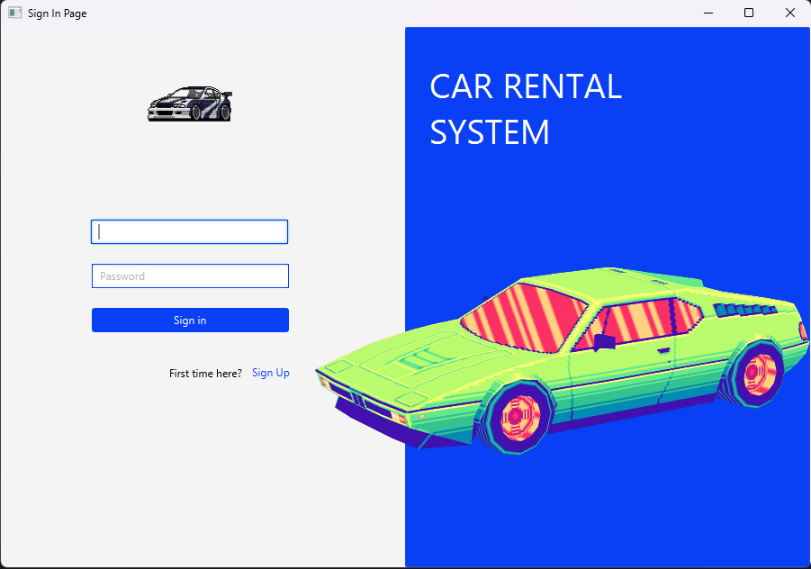
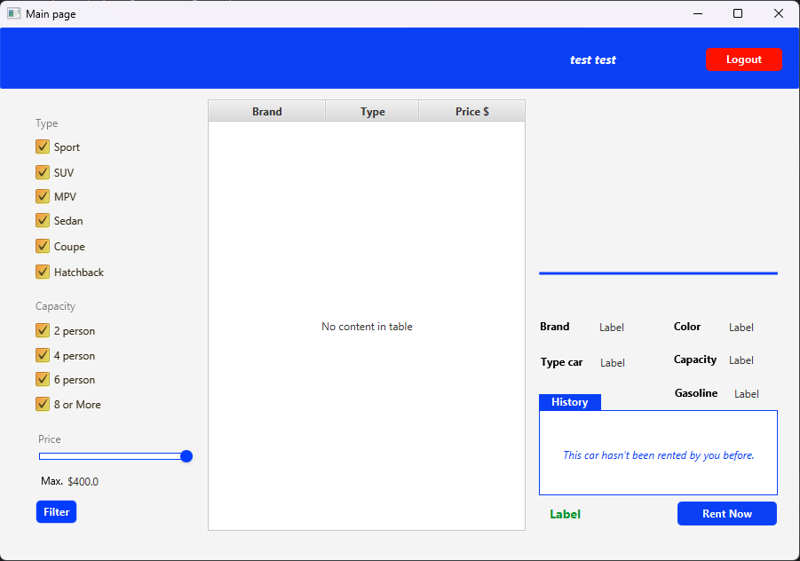

# Car Rental System

**Car Rental System

## Description
The Car Rental System is a web-based platform designed to provide a seamless and efficient car rental experience. Users can browse a variety of cars, select their preferred type based on capacity, price, and color, and easily book a rental online.

## Project Requirements List
- Vehicle Selection: Choose from various car types (sedan, SUV, sports, etc.).
- Filter Options: Sort by capacity, price, and color for a tailored selection.
- Rental Duration: Select rental start and end dates.
- Payment Integration: Secure credit card processing.
- User Authentication: Sign up and log in functionality.
- Admin Panel: Manage cars, bookings, and users.
- Error Handling: Validate user input and provide clear messages.
- Responsive Design: Optimized for mobile and desktop use.
- Security Features: Encrypted user data storage and secure payments.

## Team Members
- **Tilek Sakyev**
- **Nur Islam Kubanychbekov**

## Roles
- **Tilek Sakyev:** Frontend & backend development, database integration, error handling, and testing.
- **Nur Islam Kubanychbekov:** UI/UX design, user authentication, quality assurance, and documentation.

## Screenshots



## Commit History

### February 25, 2025
- **Tilek:** Created project.
- **Nur Islam:** Created README.md.
- **Tilek:** Added SignUp page.
- **Tilek:** Merged remote-tracking branch 'origin/master'.
- **Tilek:** Added Sign In and Sign Up pages.

### February 26, 2025
- **Nur Islam:** Implemented page switching in Sign Up section.
- **Nur Islam:** Adjusted logo positioning.
- **Tilek:** Added Main Page and Filter.
- **Tilek:** Fixed bugs.

### March 1, 2025
- **Tilek:** Added TableView for Main Page.

### March 6, 2025
- **Tilek:** Enabled car selection from table.

### March 11, 2025
- **Nur Islam:** Improved Sign In and Sign Up functionality.
- **Tilek:** Implemented admin page functions.

### April 5
**Tilek:** Added Google OAuth

## Contributors
- **Tilek Sakyev**
- **Nur Islam Kubanychbekov**

## Google OAuth

- Create project [Google Cloud Console](https://console.cloud.google.com/)
- Enable Google OAuth API
- Create credential data OAuth 2.0
- Copy file `client_secret.example.json` into `client_secret.json`
- Replace `YOUR_CLIENT_ID` and `YOUR_CLIENT_SECRET` to your data

## App running

```bash
mvn clean javafx:run
```

## Test login via Google

Uses test token:
- Email: test@test.com
- Name: Test User

